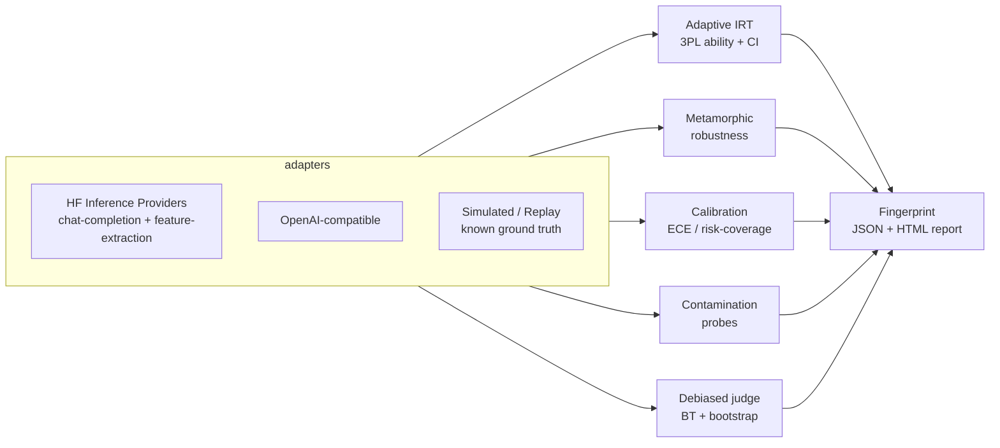

# 🔬 Caliper — measurement-science evaluation for LLMs

[](https://github.com/aabhimittal/LLM-evaluation/actions/workflows/ci.yml)
[](https://huggingface.co/spaces/abhimittal/caliper)
[](LICENSE)
[](pyproject.toml)

**Point estimates lie.** A leaderboard says model A scores 71.3 and model B scores 70.9 —
but is that difference real, robust, honest, or even earned? Caliper evaluates LLMs the
way psychometrics evaluates people: every number ships with its uncertainty, every judge
is audited for bias, and memorization is probed rather than assumed away.

**▶ Try it live: [huggingface.co/spaces/abhimittal/caliper](https://huggingface.co/spaces/abhimittal/caliper)** — no token needed for demo mode.

## Why this is different

| Existing harnesses (lm-eval-harness, HELM, lighteval, DeepEval) | Caliper |
|---|---|
| Run **all** benchmark items | **Adaptive testing (IRT)**: picks the ~35 most informative items for *this* model, with a live-shrinking confidence interval |
| Report accuracy as a point score | Reports latent **ability θ with a 95% CI**, plus how it converged |
| LLM-as-judge, order fixed | Judge runs **both presentation orders × N samples**; position bias cancels and is *reported*; verbosity bias is measured |
| Elo without error bars | **Bradley–Terry with bootstrap CIs** (Chatbot-Arena style, in 100 lines you can read) |
| Assume the benchmark is unseen | **Contamination probes**: continuation and option-recall tests for memorization |
| Score the phrasing that ships | **Metamorphic robustness**: paraphrase, typos, homoglyphs, distractors, option shuffling — same meaning, same answer? |
| Ignore confidence | **Calibration**: ECE, Brier, risk–coverage — does the model know what it doesn't know? |
| RAG faithfulness/relevance as one point score (Ragas, TruLens) | **RAG grounding with uncertainty**: claim-level faithfulness with a bootstrap CI, and each unsupported claim *localized* to its sentence — a hallucination is an address, not a lower number |

The output is a **fingerprint** — five dimensions with uncertainty — not a single number:

```
 Ability      θ = +1.08  [ +0.47, +1.69 ]   (40 adaptive items)
 Robustness   0.92       [ 0.87, 0.97 ]
 Calibration  ECE 0.11 · overconfidence +0.02
 Selective    AURC 0.07  (risk-coverage)
 Cleanliness  contamination risk 0.06
```

## Quickstart

```bash
pip install -e .            # from a clone; core deps: numpy, scipy, requests
pip install -e ".[hf]"      # + huggingface_hub for live models

# Offline demo — evaluate a simulated model with KNOWN ability, then watch
# the instruments recover it (this is also how the test suite works):
caliper run --adapter simulated --theta 0.8 --suite fingerprint --out reports/

# A real model via HF Inference Providers (chat-completion task):
export HF_TOKEN=hf_...
caliper run --adapter hf --model Qwen/Qwen2.5-7B-Instruct --suite fingerprint

# Any OpenAI-compatible endpoint:
caliper run --adapter openai --model gpt-4o-mini --token $OPENAI_API_KEY

# Judge two models pairwise, with debiasing and bootstrap-CI rankings:
caliper compare --adapter hf --judge-model meta-llama/Llama-3.3-70B-Instruct \
    --models Qwen/Qwen2.5-7B-Instruct microsoft/Phi-3.5-mini-instruct \
    --prompts examples/prompts.txt

# RAG grounding — faithfulness & relevance with confidence intervals.
# Offline demo: inject a known 30% hallucination rate and watch it get recovered,
# with each fabricated claim localized to its sample:
caliper rag --adapter simulated --hallucination-rate 0.3 --n-samples 10
# A real model on your own RAG bank (feature-extraction embeddings for relevance):
caliper rag --adapter hf --model Qwen/Qwen2.5-7B-Instruct --rag-bank my_rag.json
```

`caliper run --suite fingerprint` writes a JSON report and a self-contained HTML
report with the radar, θ-convergence, reliability diagram and risk–coverage curve.

## How it works



- **Adaptive IRT** (`caliper.irt`) — a 3PL item-response model
  `P(correct) = c + (1−c)·σ(a(θ−b))` over a bank of 250 real ARC-Challenge questions.
  Each round administers the unseen item with maximal Fisher information at the current
  θ estimate (randomesque top-k for exposure control), then re-estimates θ by MAP with a
  standard error from the posterior curvature. Sessions stop at a target SE — typically
  **30–50 items** for a CI a full benchmark run would give you.
- **Judge** (`caliper.judge`) — verdicts sampled in both orders; the debiased win
  probability feeds a Bradley–Terry fit whose CIs come from a bootstrap over matches.
  The judge itself gets an audit: position-flip rate and verbosity correlation.
- **Robustness / Calibration / Contamination** (`caliper.robustness`, `.calibration`,
  `.contamination`) — see [METHODOLOGY.md](METHODOLOGY.md) for the math and the honest
  caveats of each probe.
- **RAG grounding** (`caliper.rag`) — decomposes an answer into atomic claims, verifies
  each against the retrieved context with a sampled NLI judge, and reports faithfulness,
  answer relevance and context precision *each with a bootstrap CI* — plus the list of
  unsupported claims (hallucinations localized to the sentence). A dependency-light native
  implementation; the optional `[rag]` extra bridges to real Ragas/TruLens
  (`caliper.rag.bridge`) when you want the standard numbers too.
- **Everything is testable against ground truth**: `SimulatedSubject` has a known θ,
  calibration skew, robustness and contamination status; the test suite verifies each
  estimator recovers what was injected (`tests/`, 47 tests, no network).

### A note on the bundled item bank

The 250 questions are real (AI2 ARC-Challenge, CC BY-SA 4.0), but the bundled IRT
parameters are labeled **`synthetic-demo-v1`**: they were fit by the package's own
calibration pipeline on a *simulated* respondent population (the fit demonstrably
recovers generating parameters, r ≈ 0.88). For research-grade ability estimates,
collect a real correctness matrix (one row per model, one 0/1 column per item) and run:

```bash
caliper calibrate --matrix matrix.csv --bank src/caliper/data/item_bank.json --label my-calibration
```

This honesty matters: adaptive selection is only as good as the item parameters.

## The Space

The [Hugging Face Space](https://huggingface.co/spaces/abhimittal/caliper) has five tabs:

1. **📈 Adaptive ability** — watch θ converge item by item, CI shrinking live
2. **⚖️ Judge lab** — inject position/verbosity bias into a demo judge and watch the
   audit catch it; or run a real judge with your token
3. **🌀 Robustness** — preview perturbations, run the invariance suite
4. **🫆 Full fingerprint** — the whole battery + downloadable JSON/HTML report
5. **🔗 RAG grounding** — inject a hallucination rate, watch faithfulness recover it,
   and see each unsupported claim localized — with confidence intervals throughout

Demo mode runs entirely on simulated subjects (no token, no cost). Live mode uses your
HF token against Inference Providers (`chat-completion`), session-only.

## Repository layout

```
src/caliper/
  adapters/        HF Inference, OpenAI-compatible, Replay (record/replay), Simulated
  irt/             3PL model, MAP ability + SE, Fisher-information adaptive sessions
  judge/           debiased pairwise judging, Bradley–Terry + bootstrap
  robustness/      metamorphic perturbations + invariance suite
  calibration/     ECE, Brier, risk–coverage
  contamination/   continuation & option-recall probes, n-gram screening
  rag/             claim-level faithfulness + answer/context relevance (with CIs),
                   optional Ragas/TruLens bridge, bundled demo RAG bank
  report/          fingerprint assembly, self-contained HTML reports
  data/            bundled item bank (250 ARC-Challenge items)
scripts/           item-bank & RAG-bank builders (HF datasets-server), Space deployment
space/             the Gradio app published to HF Spaces
tests/             ground-truth recovery tests for every estimator
```

## Development

```bash
pip install -e ".[dev]"
pytest -q          # 47 tests, ~5s, fully offline
ruff check src tests scripts
```

## License

MIT. Item bank questions from [AI2 ARC](https://huggingface.co/datasets/allenai/ai2_arc)
(CC BY-SA 4.0). Not affiliated with the benchmark authors.
