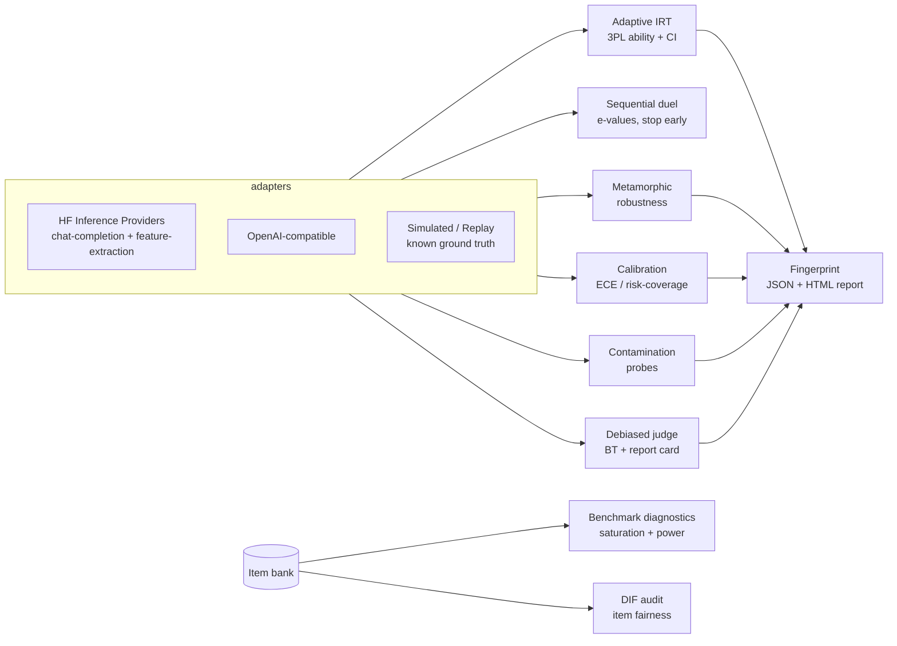

# 🔬 Caliper — measurement-science evaluation for LLMs

[](https://github.com/aabhimittal/LLM-evaluation/actions/workflows/ci.yml)
[](https://huggingface.co/spaces/abhimittal/caliper)
[](LICENSE)
[](pyproject.toml)

**Point estimates lie.** A leaderboard says model A scores 71.3 and model B scores 70.9 —
but is that difference real, robust, honest, or even earned? Caliper evaluates LLMs the
way psychometrics evaluates people: every number ships with its uncertainty, every judge
is audited for bias, and memorization is probed rather than assumed away.

**▶ Try it live: [huggingface.co/spaces/abhimittal/caliper](https://huggingface.co/spaces/abhimittal/caliper)** — no token needed for demo mode.

## Why this is different

| Existing harnesses (lm-eval-harness, HELM, lighteval, DeepEval) | Caliper |
|---|---|
| Run **all** benchmark items | **Adaptive testing (IRT)**: picks the ~35 most informative items for *this* model, with a live-shrinking confidence interval |
| Report accuracy as a point score | Reports latent **ability θ with a 95% CI**, plus how it converged |
| Fixed sample size; peeking invalidates the p-value | **Anytime-valid duels** (e-values): peek after every item, stop the moment a winner is clear — type-I error still ≤ α |
| LLM-as-judge, order fixed | Judge runs **both presentation orders × N samples**; position bias cancels and is *reported*; verbosity bias is measured |
| "Our judge agrees with humans 80% of the time" | **Judge report card**: Cohen's κ, excess bias over humans, confidence-AUC, letter grade |
| Elo without error bars | **Bradley–Terry with bootstrap CIs** (Chatbot-Arena style, in 100 lines you can read) |
| Assume the benchmark is unseen | **Contamination probes**: continuation and option-recall tests for memorization |
| Score the phrasing that ships | **Metamorphic robustness**: paraphrase, typos, homoglyphs, distractors, option shuffling — same meaning, same answer? |
| Ignore confidence | **Calibration**: ECE, Brier, risk–coverage — does the model know what it doesn't know? |
| RAG faithfulness/relevance as one point score (Ragas, TruLens) | **RAG grounding with uncertainty**: claim-level faithfulness with a bootstrap CI, and each unsupported claim *localized* to its sentence — a hallucination is an address, not a lower number |
| Trust the LLM judge that grades faithfulness | **The grader gets graded**: the verifier is measured against known-truth controls, and faithfulness is *bias-corrected* for its sensitivity/specificity (Rogan–Gladen); a chance-level verifier is refused, not averaged |
| Assume a high faithfulness score means retrieval worked | **Attribution probe**: re-answers with the context removed, swapped and polluted — separates answers *earned by retrieval* from parametric memory |
| Never question the benchmark | **Benchmark diagnostics**: saturation ceiling, minimum detectable difference, and **DIF** — which items are unfair between model families |

The output is a **fingerprint** — five dimensions with uncertainty — not a single number:

```
 Ability      θ = +1.08  [ +0.47, +1.69 ]   (40 adaptive items)
 Robustness   0.92       [ 0.87, 0.97 ]
 Calibration  ECE 0.11 · overconfidence +0.02
 Selective    AURC 0.07  (risk-coverage)
 Cleanliness  contamination risk 0.06
```

## Quickstart

```bash
pip install -e .            # from a clone; core deps: numpy, scipy, requests
pip install -e ".[hf]"      # + huggingface_hub for live models

# Offline demo — evaluate a simulated model with KNOWN ability, then watch
# the instruments recover it (this is also how the test suite works):
caliper run --adapter simulated --theta 0.8 --suite fingerprint --out reports/

# A real model via HF Inference Providers (chat-completion task):
export HF_TOKEN=hf_...
caliper run --adapter hf --model Qwen/Qwen2.5-7B-Instruct --suite fingerprint

# Any OpenAI-compatible endpoint:
caliper run --adapter openai --model gpt-4o-mini --token $OPENAI_API_KEY

# Judge two models pairwise, with debiasing and bootstrap-CI rankings:
caliper compare --adapter hf --judge-model meta-llama/Llama-3.3-70B-Instruct \
    --models Qwen/Qwen2.5-7B-Instruct microsoft/Phi-3.5-mini-instruct \
    --prompts examples/prompts.txt

# RAG grounding — faithfulness & relevance with confidence intervals.
# Offline demo: inject a known 30% hallucination rate and watch it get recovered,
# with each fabricated claim localized to its sample:
caliper rag --adapter simulated --hallucination-rate 0.3 --n-samples 10

# The grader gets graded: give the verifier a rubber-stamping bias (specificity
# 0.55) and watch the raw score inflate while the corrected one holds:
caliper rag --adapter simulated --hallucination-rate 0.5 \
    --verifier-sensitivity 0.95 --verifier-specificity 0.55

# Retrieval has to prove it did the work. A model recalling the answer from
# memory still scores faithfulness 0.90 — Ragas/TruLens would call that
# excellent — while `earned_by_retrieval` collapses to 0.00:
caliper rag --adapter simulated --context-reliance 0.0 --hallucination-rate 0.0

# A real model on your own RAG bank (feature-extraction embeddings for relevance):
caliper rag --adapter hf --model Qwen/Qwen2.5-7B-Instruct --rag-bank my_rag.json \
    --out reports/          # writes JSON + a self-contained HTML report

# Head-to-head that stops as soon as the winner is statistically decided:
caliper duel --adapter simulated --theta 0.6 --theta-b -1.2
#   -> decided at item 42 of a 200-item budget; peeking cost nothing

# Grade a judge against human labels before trusting it to rank anything:
caliper judge-card --adapter hf --judge-model meta-llama/Llama-3.3-70B-Instruct \
    --data examples/gold_preferences.jsonl

# Ask what the benchmark itself can measure, and audit it for biased items:
caliper diagnose --test-length 40
caliper dif --matrix matrix.csv --groups groups.csv
```

`caliper run --suite fingerprint` writes a JSON report and a self-contained HTML
report with the radar, θ-convergence, reliability diagram and risk–coverage curve.

## How it works


```mermaid
flowchart LR
    subgraph adapters
        HF[HF Inference Providers\nchat-completion + feature-extraction]
        OAI[OpenAI-compatible]
        SIM[Simulated / Replay\nknown ground truth]
    end
    adapters --> IRT[Adaptive IRT\n3PL ability + CI]
    adapters --> SEQ[Sequential duel\ne-values, stop early]
    adapters --> ROB[Metamorphic\nrobustness]
    adapters --> CAL[Calibration\nECE / risk-coverage]
    adapters --> CON[Contamination\nprobes]
    adapters --> JUD[Debiased judge\nBT + report card]
    IRT --> FP[Fingerprint\nJSON + HTML report]
    ROB --> FP
    CAL --> FP
    CON --> FP
    JUD --> FP
    BANK[(Item bank)] --> DIAG[Benchmark diagnostics\nsaturation + power]
    BANK --> DIF[DIF audit\nitem fairness]
```

- **Adaptive IRT** (`caliper.irt`) — a 3PL item-response model
  `P(correct) = c + (1−c)·σ(a(θ−b))` over a bank of 250 real ARC-Challenge questions.
  Each round administers the unseen item with maximal Fisher information at the current
  θ estimate (randomesque top-k for exposure control), then re-estimates θ by MAP with a
  standard error from the posterior curvature. Sessions stop at a target SE — typically
  **30–50 items** for a CI a full benchmark run would give you.
- **Sequential duels** (`caliper.sequential`) — a betting **e-process**: wealth starts
  at 1 and is staked on each paired outcome, so under the null it is a nonnegative
  martingale and Ville's inequality caps the false-positive rate at α *for every
  stopping rule at once*. Verified empirically in `tests/test_sequential.py`:
  **2% false positives under peek-every-item, where a naive repeated z-test hits 42%**.
  Ships with a Robbins normal-mixture confidence sequence for the win rate.
- **Judge** (`caliper.judge`) — verdicts sampled in both orders; the debiased win
  probability feeds a Bradley–Terry fit whose CIs come from a bootstrap over matches.
  The judge itself gets an audit (position-flip rate, verbosity correlation) and, when
  you have human labels, a **report card**: Cohen's κ, bias *in excess of* the humans',
  whether its confidence predicts its correctness, and a letter grade.
- **Benchmark diagnostics** (`caliper.diagnostics`, `caliper.dif`) — the test
  information function says where a bank can still measure and where it has
  **saturated**; power analysis gives the minimum detectable ability gap for an item
  budget; **Differential Item Functioning** (Mantel–Haenszel with rest-score matching
  and two-stage purification, ETS delta classification) flags items that behave
  differently between two model families *at matched ability*.
- **Robustness / Calibration / Contamination** (`caliper.robustness`, `.calibration`,
  `.contamination`) — see [METHODOLOGY.md](METHODOLOGY.md) for the math and the honest
  caveats of each probe.
- **RAG grounding** (`caliper.rag`) — decomposes an answer into atomic claims, verifies
  each against the retrieved context with a sampled NLI judge, and reports faithfulness,
  answer relevance and context precision *each with a bootstrap CI* — plus the list of
  unsupported claims (hallucinations localized to the sentence). A dependency-light native
  implementation; the optional `[rag]` extra bridges to real Ragas/TruLens
  (`caliper.rag.bridge`) when you want the standard numbers too.
- **Verifier audit** (`caliper.rag.audit`) — the model grading faithfulness is itself an
  instrument, so it gets measured: sensitivity and specificity against positive controls
  (sentences from the sample's own passages) and negative controls (sentences from another
  sample's), then faithfulness is **bias-corrected** by the Rogan–Gladen estimator
  `(p_obs + sp − 1) / (se + sp − 1)`. A verifier no better than chance is reported as
  unusable rather than silently trusted.
- **Attribution probe** (`caliper.rag.attribution`) — re-asks each question with the
  context **removed**, **swapped** for another question's passages, and **polluted** with
  an irrelevant one. `parametric_leakage`, `context_sensitivity` and
  `distractor_stability` combine into `earned_by_retrieval`: a model that answers
  identically without its context did not earn the score.
- **Everything is testable against ground truth**: `SimulatedSubject` has a known θ,
  calibration skew, robustness and contamination status; the test suite verifies each
  estimator recovers what was injected (`tests/`, 101 tests, no network). The
  anytime-validity guarantee is *measured*, not asserted: 400 simulated null
  comparisons with adversarial peeking must keep the false-positive rate under α.

### A note on the bundled item bank

The 250 questions are real (AI2 ARC-Challenge, CC BY-SA 4.0), but the bundled IRT
parameters are labeled **`synthetic-demo-v1`**: they were fit by the package's own
calibration pipeline on a *simulated* respondent population (the fit demonstrably
recovers generating parameters, r ≈ 0.88). For research-grade ability estimates,
collect a real correctness matrix (one row per model, one 0/1 column per item) and run:

```bash
caliper calibrate --matrix matrix.csv --bank src/caliper/data/item_bank.json --label my-calibration
```

This honesty matters: adaptive selection is only as good as the item parameters.

## The Space

The [Hugging Face Space](https://huggingface.co/spaces/abhimittal/caliper) has eight tabs:

1. **📈 Adaptive ability** — watch θ converge item by item, CI shrinking live
2. **⚖️ Judge lab** — inject position/verbosity bias into a demo judge and watch the
   audit catch it, then **grade the judge** against human labels (κ, excess bias,
   confidence AUC, letter grade); or run a real judge with your token
3. **🌀 Robustness** — preview perturbations, run the invariance suite
4. **🫆 Full fingerprint** — the whole battery + downloadable JSON/HTML report
5. **🔗 RAG grounding** — inject a hallucination rate and watch faithfulness recover it,
   with every unsupported claim localized; then bias the *verifier* and watch the raw
   score go wrong while the corrected one holds, or set context reliance to 0 and watch
   `earned_by_retrieval` collapse while faithfulness stays high
6. **⚔️ Sequential duel** — two models, streaming evidence, stops the moment the winner
   is decided (default demo settles at item ~42 of a 200-item budget)
7. **🩺 Benchmark diagnostics** — the SE-vs-ability curve, saturation ceiling, minimum
   detectable difference, adaptive-vs-random efficiency
8. **🔎 Item bias (DIF)** — rig some items in favour of one model family, then watch the
   auditor separate real bias from an honest ability gap

Demo mode runs entirely on simulated subjects (no token, no cost). Live mode uses your
HF token against Inference Providers (`chat-completion`), session-only.

## Repository layout

```
src/caliper/
  adapters/        HF Inference, OpenAI-compatible, Replay (record/replay), Simulated
  irt/             3PL model, MAP ability + SE, Fisher-information adaptive sessions
  sequential/      e-process duels + Robbins confidence sequences (anytime-valid)
  judge/           debiased pairwise judging, Bradley–Terry + bootstrap, report card
  dif/             Mantel–Haenszel differential item functioning, ETS delta
  diagnostics/     test information, saturation ceiling, power, adaptive efficiency
  robustness/      metamorphic perturbations + invariance suite
  calibration/     ECE, Brier, risk–coverage
  contamination/   continuation & option-recall probes, n-gram screening
  rag/             claim-level faithfulness + answer/context relevance (with CIs),
                   verifier audit & bias correction, retrieval-attribution probe,
                   optional Ragas/TruLens bridge, bundled demo RAG bank
  report/          fingerprint assembly, self-contained HTML reports
  data/            bundled item bank (250 ARC-Challenge items)
examples/          runnable demos + a labeled preference set for judge grading
scripts/           item-bank & RAG-bank builders (HF datasets-server), Space deployment
space/             the Gradio app published to HF Spaces
tests/             ground-truth recovery tests for every estimator
```

## Development

```bash
pip install -e ".[dev]"
pytest -q          # 101 tests, ~13s, fully offline
ruff check src tests scripts
```

## License

MIT. Item bank questions from [AI2 ARC](https://huggingface.co/datasets/allenai/ai2_arc)
(CC BY-SA 4.0). Not affiliated with the benchmark authors.
